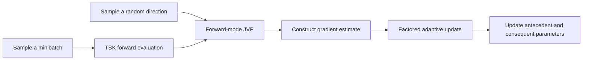

<div align="center">

# FGE–FAU

### Efficient Training of TSK Fuzzy Systems via<br>Forward Gradient Estimation and Factored Adaptive Updates

**Hui Zhang · Wei Peng (Member, IEEE) · Chengdong Li (Member, IEEE) · Bo Sun (Member, IEEE) · Qinglai Wei (Senior Member, IEEE) · Jian Wang (Senior Member, IEEE)**

**Submitted to IEEE Transactions on Fuzzy Systems (TFS)**


[](LICENSE)

**Forward gradient estimation · Joint parameter learning · Factored adaptive updates**

[Overview](#overview) · [Method](#method) · [Quick start](#quick-start) · [Experiments](#experiments) · [Citation](#citation) · [Contact](#contact)

</div>

---

## Overview

This repository accompanies the manuscript **“Efficient Training of TSK Fuzzy Systems via Forward Gradient Estimation and Factored Adaptive Updates.”** It provides a PyTorch implementation and a PM10 regression example for exploring the proposed training approach.

FGE–FAU combines **forward gradient estimation (FGE)** with **factored adaptive updates (FAU)** to train Takagi–Sugeno–Kang (TSK) fuzzy systems. It jointly updates antecedent and consequent parameters using a matrix-free Jacobian–vector product, without a reverse-mode backpropagation pass in the training loop.

| Component | Role |
| :--- | :--- |
| **TSK fuzzy model** | Gaussian antecedent membership functions and linear rule consequents for nonlinear regression. |
| **Forward gradient estimation** | Constructs a stochastic gradient estimate from a directional derivative computed during forward propagation. |
| **Factored adaptive updates** | Uses row and column statistics to represent adaptive scaling information compactly. |
| **Evaluation** | Studies predictive accuracy, training time, and memory requirements across nine regression datasets in the manuscript. |

> **Paper status:** submitted to *IEEE Transactions on Fuzzy Systems*. This repository does not indicate acceptance or publication.

## Method



For a minibatch loss $L(\theta)$ and a random direction $v$ with $\mathbb{E}[vv^{\mathsf T}]=I$, forward-mode automatic differentiation computes the directional derivative

$$
s = \nabla_{\theta} L(\theta)^{\mathsf T}v,
\qquad
\widehat{g} = s v.
$$

The resulting vector is a **stochastic gradient estimate**, rather than the exact full gradient from a single directional derivative. Under the stated sampling condition, its expectation equals the gradient. The implementation uses Gaussian random directions and `functorch.jvp`.

The update stage maintains factored statistics for adaptive scaling. The current implementation also retains a full-sized momentum buffer; factorization reduces selected optimizer-state storage rather than removing all moment information.

<details>
<summary><strong>Paper terminology and implementation names</strong></summary>

The manuscript uses **FGE–FAU**. The implementation retains the earlier identifier `MBFAD_EAO` in its module, function, comments, and output filenames:

| Paper terminology | Implementation |
| :--- | :--- |
| FGE–FAU training routine | `MBFAD_EAO.py` → `MBFAD_EAO(...)` |
| TSK fuzzy system | `model.py` → `TSK_FS` |
| Forward-mode differentiation | `functorch.make_functional` and `functorch.jvp` |
| Example entry point | `main.py` |

Use the existing filenames and function names when running the code.

</details>

## Quick start

### 1. Prepare the environment

Open a terminal in the repository root, where `main.py` is located. The original README specifies **Python 3.7**, and the dependency file pins **PyTorch 1.13.1** and the packages below. This is a legacy dependency stack, not a claim of compatibility with current package releases.

| Package | Version |
| :--- | :--- |
| PyTorch | 1.13.1 |
| NumPy | 1.21.6 |
| pandas | 1.3.5 |
| scikit-learn | 1.0.2 |
| Matplotlib | 3.5.3 |

Install the pinned dependencies, then explicitly install the matching `functorch` package and SciPy used by the data loader:

```bash
python -m pip install -r requirements.txt
python -m pip install functorch==1.13.1 scipy==1.7.3
```

`functorch` and SciPy are imported by the code but are not explicitly listed in `requirements.txt`. The commands above supplement that file. The supplied example creates CPU tensors by default and does not require a CUDA configuration.

### 2. Run the supplied example

```bash
python main.py
```

The script loads `dataset/PM10.mat`, trains the TSK model, prints training loss, test loss, and update time, and saves a plot to:

```text
pic/PM10_MBFAD_EAO.png
```

The plot is also displayed in a Matplotlib window. The script returns loss and timing histories; it does not save a trained-model checkpoint.

### 3. Inspect the configuration

The defaults in `configs.py` are:

| Setting | Default | Meaning |
| :--- | :--- | :--- |
| `dataset_name` | `PM10` | Included example dataset |
| `v` | `0.7` | Fraction of rows used for training |
| `M` | `7` | Number of input features |
| `nMFs` | `2` | Membership functions per input |
| `P` | `0.7` | Rule retention probability in the implemented DropRule routine |
| `batch_size` | `64` | Samples drawn per update |
| `epochs` | `500` | Number of minibatch update iterations |
| `lr` | `1e-3` | Learning rate |
| `d` | `2` | Update clipping parameter in the supplied configuration |

The random seed is set to `42` in `main.py`. Each iteration samples one minibatch with replacement; the `epochs` setting does not represent complete passes through the dataset. The model uses double-precision tensors and a grid rule base with `nMFs ** M` rules. The current rule-index helper assumes two membership functions per input.

## Repository structure

```text
.
├── main.py              # PM10 example entry point
├── configs.py           # Dataset and optimizer configuration
├── model.py             # TSK fuzzy model and DropRule
├── MBFAD_EAO.py          # Forward gradient estimation and adaptive updates
├── loss.py              # Training and evaluation objectives
├── dataloader.py        # MATLAB data loading, normalization, and splitting
├── utils.py             # Plotting and rule-index utilities
├── dataset/
│   └── PM10.mat         # Included demonstration dataset
├── pic/                 # Existing figures and generated plots
├── requirements.txt     # Pinned dependencies
├── LICENSE              # Apache License 2.0
└── README.md
```

## Experiments

The manuscript evaluates FGE–FAU against **MBGD-Adam, MBGD-RDA, MBGD-AdaGrad, MBGD-SGD, MBGD-RMSProp, and MBGD-Momentum**. It reports the lowest testing RMSE on seven of the nine datasets, together with reduced training time relative to the compared methods. Memory comparisons depend on the optimizer: reduced storage relative to Adam/RDA does not imply lower storage than every baseline, including SGD.

The table below summarizes the datasets described in the manuscript. Feature counts distinguish the original inputs from those used in the reported experiments.

| Dataset | Samples | Original features | Features used |
| :--- | ---: | ---: | ---: |
| NO2 | 500 | 7 | 7 |
| Housing | 506 | 13 | 9 |
| Concrete | 1,030 | 8 | 8 |
| Airfoil | 1,503 | 5 | 5 |
| Wine-Red | 1,599 | 11 | 6 |
| Abalone | 4,177 | 8 | 7 |
| Wine-White | 4,898 | 11 | 6 |
| PowerPlant | 9,568 | 4 | 4 |
| Protein | 45,730 | 9 | 9 |

**Release scope.** This repository currently includes the **PM10 demonstration**, not a complete automated reproduction suite for the nine-dataset study. The other datasets, baseline training routines, and dataset-specific preprocessing configurations are not included. PM10 should not be treated as the manuscript's NO2 dataset.

### Using another dataset

The loader expects a MATLAB `.mat` file containing a numeric array named `data`:

```text
data.shape = (number_of_samples, number_of_features + 1)

Columns 0 through M-1 : input features
Last column          : scalar regression target
```

To adapt the example, add a dataset configuration with the file path and input dimension in `configs.py`, then select it through `config("YourDataset")` in `main.py`. Match the dataset-specific preprocessing and experimental settings before comparing results with the manuscript.

<details>
<summary><strong>Reproducibility notes for the supplied example</strong></summary>

- **Data split:** the loader uses the first 70% of rows for training and the remaining rows for testing, without shuffling.
- **Normalization:** the current loader fits min–max scalers to the full dataset before splitting. For an independent held-out evaluation, preprocessing should instead be fitted on the training partition; this requires a code change beyond the instructions in this README.
- **Loss reporting:** `loss.py` implements squared-error-based objectives, with consequent-weight regularization during training. The plot's existing “RMSE loss” label does not mean that the returned values are directly computed RMSE. Do not compare these logged values directly with the manuscript's RMSE tables.
- **Timing:** the reported per-iteration time covers minibatch sampling, gradient estimation, and parameter updates; it excludes the subsequent test evaluation and plotting.
- **Configuration:** the supplied `d = 2` differs from `d = 1` in the manuscript's main comparison table. The demo defaults alone do not reproduce that experimental configuration.

</details>

## Citation

If you use this work, please cite the manuscript. Until a formal publication record is available, use an unpublished-manuscript entry:

```bibtex
@unpublished{zhang2026fgefau,
  author = {Zhang, Hui and Peng, Wei and Li, Chengdong and Sun, Bo
            and Wei, Qinglai and Wang, Jian},
  title  = {Efficient Training of {TSK} Fuzzy Systems via Forward
            Gradient Estimation and Factored Adaptive Updates},
  year   = {2026},
  note   = {Manuscript submitted to IEEE Transactions on Fuzzy Systems}
}
```

## Acknowledgments

The source code credits [Dongrui Wu's MBGD-RDA implementation](https://github.com/drwuHUST/MBGD_RDA) for the DropRule and rule-index utilities.

## License

The repository includes the **Apache License 2.0**. See [LICENSE](LICENSE) for the full terms.

## Contact

For implementation questions, please open a GitHub issue or contact **Hui Zhang**:

- [202234949@mail.sdu.edu.cn](mailto:202234949@mail.sdu.edu.cn)
- [bigserendipty@gmail.com](mailto:bigserendipty@gmail.com)
